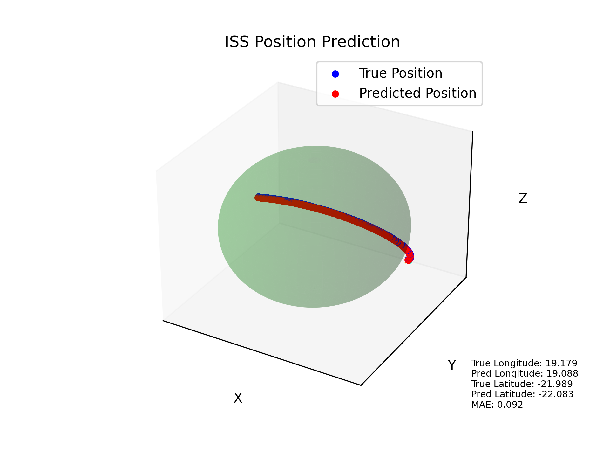

# International Space Station Position Prediction Project

The goal of the project is to develop a system for predicting the position of the International Space Station (ISS) in geographical coordinate space. To achieve this goal, a set of tools and scripts has been prepared to collect data, train the model and visualize the actual and predicted position of the ISS.

## Installation

1. Clone the repository:

    ```bash
    git clone https://github.com/Dawidemm/iss-position-prediction
    cd iss-position-prediction
    ```

2. Python Version:

   This project is developed using Python version 3.10.9.

3. Install the required libraries using the provided `requirements.txt` file:

    ```bash
    pip install -r requirements.txt
    ```

## Description of executables:

### - generate_dataset.py

This script utilizes the `GenerateDataset` class from the `modules.dataset_generator` module to generate new datasets for training, validation, and testing.

#### Usage

1. Run the script using the following command:

    ```bash
    python generate_dataset.py
    ```

2. Upon execution, the program collects data in real-time to generate new datasets for training, validation, and testing. Please note that the process may take some time due to real-time data collection.

3. The generated datasets can be utilized for model training in the `train_pipeline.py` file.

#### Functionality

The script defines a `generate_dataset` function that takes two parameters:
- `type` (str): Specifies the type of dataset to generate ('new_train', 'new_val', or 'new_test').
- `samples` (int): Specifies the number of samples to be collected for the dataset.

The script generates three datasets with different types and sample sizes:
1. Training dataset: `generate_dataset(type='new_train', samples=700)`
2. Validation dataset: `generate_dataset(type='new_val', samples=200)`
3. Testing dataset: `generate_dataset(type='new_test', samples=100)`

Datasets are saved as CSV files using the `save_as_csv` method of the `GenerateDataset` class.

### - train_pipeline.py

This script defines a PyTorch Lightning training pipeline for a machine learning model using the `LightningLatLongPredictor` model, `LightningLatLongDatamodule` data module, and various PyTorch Lightning functionalities.

#### Usage

1. Run the script:

    ```bash
    python train_pipeline.py
    ```

#### Training Pipeline

The `train_pipeline` function performs the following steps:

1. Initializes a Lightning data module (`LightningLatLongDatamodule`) with training, validation, and testing datasets from specified CSV files (`TRAIN_DATASET_PATH`, `VAL_DATASET_PATH`, `TEST_DATASET_PATH`) and a specified batch size (`BATCH_SIZE`).

2. Initializes a Lightning model (`LightningLatLongPredictor`).

3. Configures a PyTorch Lightning Trainer with the following parameters:
   - `max_epochs`: Maximum number of training epochs (50 in this case).
   - `accelerator`: The accelerator is set to 'auto', allowing PyTorch Lightning to automatically choose the appropriate accelerator device based on the available hardware (CPU or GPU).
   - `callbacks`: Utilizes EarlyStopping callback to monitor the 'val_loss' and stop training if it does not improve within a patience of 5 epochs. Additionally, it uses the ModelCheckpoint callback to save the best model based on the 'val_loss' during training.
   - `logger`: The logger is set to False, indicating that no logging will be performed during training.

4. Fits the Lightning model to the training data using the provided data module.

5. Evaluates the trained model on the test data and prints the Mean Squared Error (MSE).

Note: Users can modify the paths to CSV files (`TRAIN_DATASET_PATH`, `VAL_DATASET_PATH`, `TEST_DATASET_PATH`) in the script to point to their generated datasets.

### - main.py

This script provides a real-time visualization of the predictions made by the trained model (`LightningLatLongPredictor`) on longitude and latitude coordinates. The visualization includes both true and predicted points in a 3D plot.

#### Usage

1. **Navigate to the `is-position-prediction` directory** in your terminal.
2. Run the script:

    ```bash
    python src/visualization.py
    ```

#### Real-time Visualization

The `visualization.py` script does the following:

1. Loads a pre-trained PyTorch Lightning model (`LightningLatLongPredictor`) from a specified checkpoint using the `get_model_checkpoint_path` utility function.

2. Sets up a 3D plot using Matplotlib for visualizing true and predicted longitude and latitude coordinates in real-time.

3. Defines an update function (`update_plot`) for the Matplotlib animation, which:
   - Fetches real-time data using the `FetchData` class.
   - Processes the data for input to the model.
   - Makes predictions using the pre-trained model.
   - Updates the 3D plot with true and predicted points.
   - Calculates and displays Mean Absolute Error (MAE) between true and predicted coordinates.

4. Initializes a Matplotlib FuncAnimation object (`ani`) to continuously update the plot in real-time.

5. Allows pausing and resuming the animation by pressing any key.

Note: Users can change the utilized model by providing their model checkpoint path. This can be achieved by modifying the `get_model_checkpoint_path` function in the script by setting argument to `selection='last'`, which returns the checkpoint path for the `load_from_checkpoint` method.

#### Eample visualization.py output
<p align='center'>
    
</p>


### - ISS Prediction Web Application (app.py)

The `app.py` file implements a Flask web application for predicting the position of the International Space Station (ISS) in real-time using a trained model. Below is a breakdown of the components and instructions for running the application:

#### Functionality

- **Flask Application Setup**: Initializes a Flask application.
- **GetData Class**: Defines a class for fetching real-time data and making predictions using a trained model.
- **Flask Routes**:
  - `/`: Renders the main HTML template.
  - `/stream`: Streams real-time ISS data and predictions to the client.
- **HTML Template**: Provides a simple HTML page with a Plotly chart to visualize the true and predicted positions of the ISS.
- **JavaScript**:
  - Sets up a Plotly chart for real-time visualization.
  - Establishes an EventSource to stream data from the server.
  - Updates the Plotly chart with new data received from the server.

#### Usage

1. Ensure you have Python and the required dependencies installed.
2. **Navigate to the `is-position-prediction` directory** in your terminal.
3. Run the following command in your terminal to start the Flask application:

    ```bash
    python src/app.py
    ```

4. The application will start, and the address where you can access it will be displayed in the terminal, typically in the format `http://127.0.0.1:5000`.

5. Open your web browser and navigate to the displayed address to access the ISS prediction web interface.